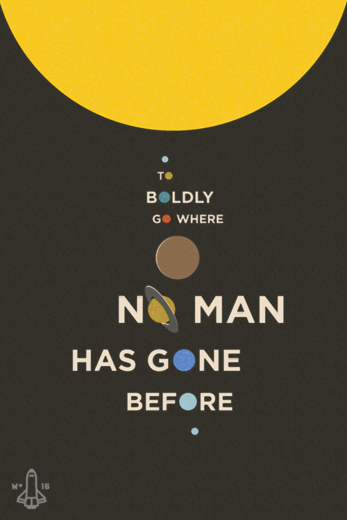

# SPACEofPHD

## SPACE

轨道动力学，轨道竞赛，空间碎片，深空探测，行星探测……

## PHD

MATLAB，JAVA，优化算法，Google，小米，Android，LaTeX，PPT，Word，Kindle，科幻，Machine Learning，营销推广，机器人，Arduino，时间管理，护眼软件，Mendeley，Zotero，Linux，macOS，Windows，~~百度~~，MarkDown，维基百科，YouTube……

## SPACEofPHD

