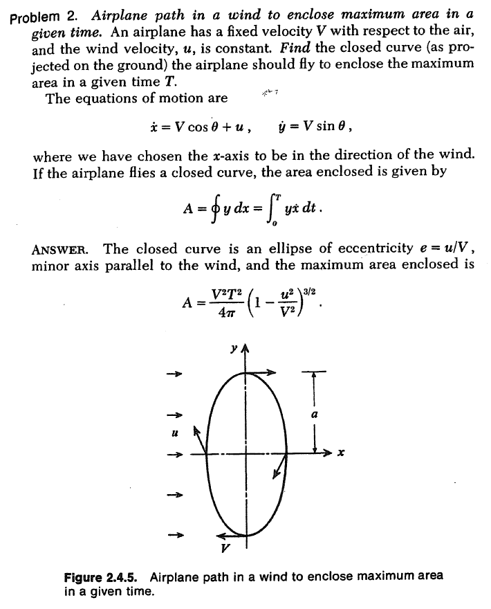
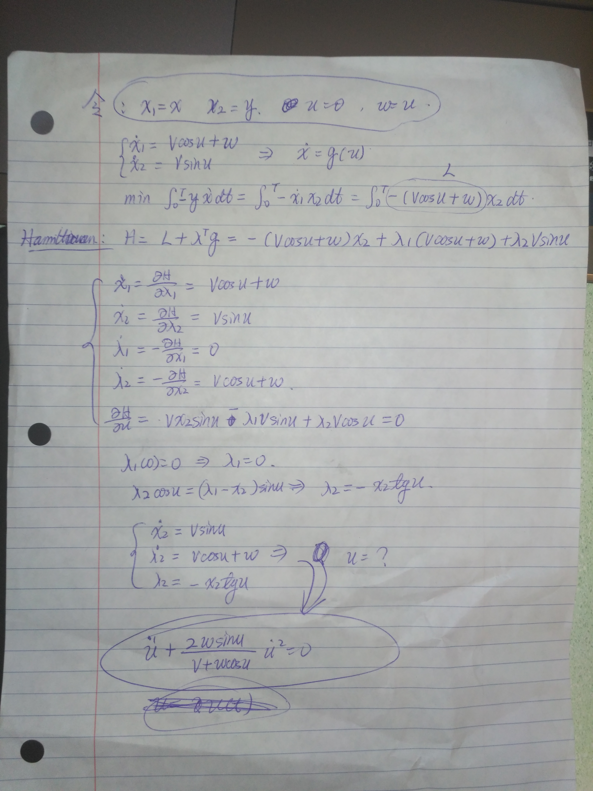
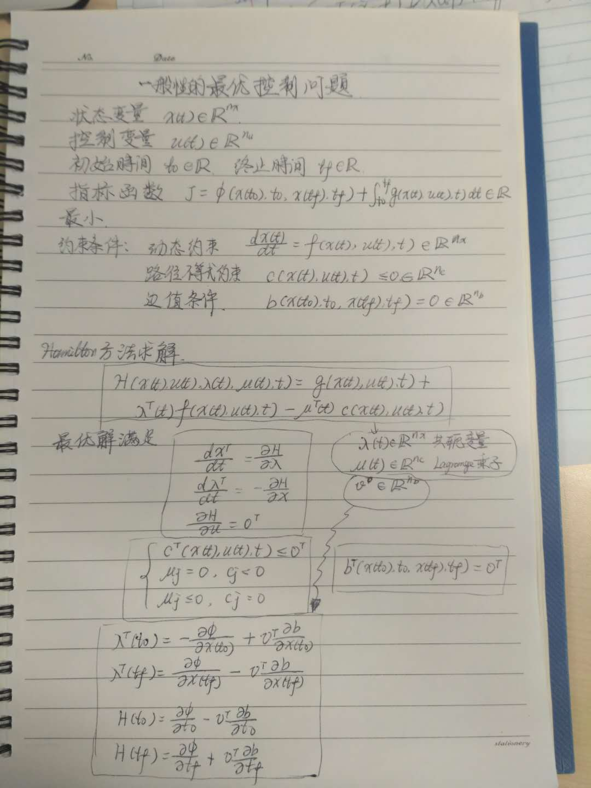
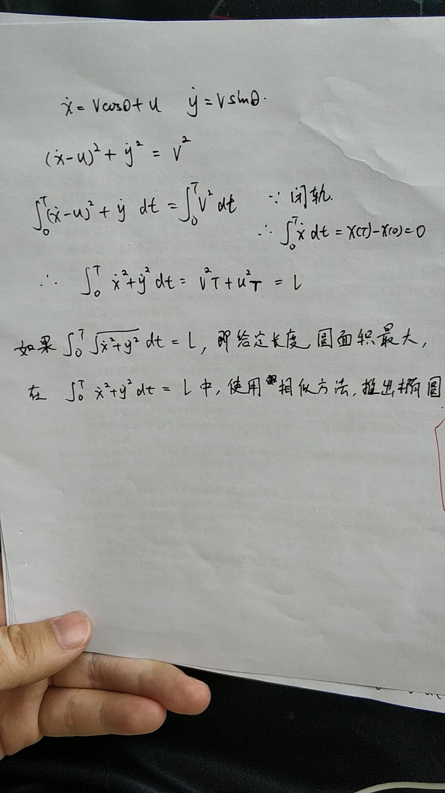

title: 解题答案
abbrlink: a5263334
categories:
  - Math - Optimal Control
tags:
  - draft
  - Optimal Control
mathjax: true
date: 2019-05-02 14:04:00
updated:
---

Failed to solve this problem:

<!--  -->

$\dot x = V \cos\theta + u$\
$\dot y = V \sin\theta$

$\max\quad A=\int_0^T y\dot x \, dt$

> ANSWER: $A = \frac{V^2T^2}{4\pi}\left(1-\frac{u^2}{V^2}\right)^{3/2}$

> SOLUTION:

Minimize: \
$\min\quad J=\int_0^T -y\dot x\,dt$

The Hamiltonian is: \
$H = -y\dot x + \lambda_x(V\cos\theta+u) + \lambda_yV\sin\theta$ \
$\hphantom{H} = -y(V\cos\theta+u) + \lambda_x(V\cos\theta+u) + \lambda_yV\sin\theta$ \
$\hphantom{H} = \lambda_yV\sin\theta - (y-\lambda_x)V\cos\theta - yu + \lambda_xu$

The optimal condition is determined by: \
$\frac{\partial H}{\partial\theta} = \lambda_yV\cos\theta + (y-\lambda_x)V\sin\theta = 0$ \
The optimal control law is: \
$\tan\theta = -\frac{\lambda_y}{y-\lambda_x}$

Influence functions: \
$\dot \lambda_x = - \frac{\partial H}{\partial x} = 0$ \
$\dot \lambda_y = - \frac{\partial H}{\partial y} = \dot x = V\cos\theta+u$ \
Integrate to yeild: \
$\lambda_x = c_1$ \
$\lambda_y = x + c_2$

The boundary conditions are: \
$x(t_0) = x_0$, $x(T) = x_0$, $\lambda_x(T) = 0$ \
$y(t_0) = 0$, $y(T) = 0$, $\lambda_y(T) = 0$ \
With $\lambda_x(T)=0$, it follows that $c_1=0$, then $\lambda_x=0$. \
With $\lambda_y(T)=0$, it follows that $c_2=\lambda_y(T)-x(T)=-x_0$, then $\lambda_y=x-x_0$.

Since $H$ and $f$ does not explicitly depend on $t$, $H$ is a constant: \
$H = H(t_0)$ \
$= H(\theta=0) =-(y(\theta=0)-\lambda_x)V-y(\theta=0)u = -y(\theta=0)V-y(\theta=0)u$ \
$= H(\theta=\pi) = (y(\theta=\pi)-\lambda_x)V -y(\theta=\pi)u = y(\theta=\pi)V-y(\theta=\pi)u \Rightarrow y(\theta=\pi)=-y(\theta=0)$

Then the optimal control law becomes: \
$\tan\theta = -\frac{x-x_0}{y} = \frac{\dot y}{\dot x-u}$

Equalize the control law to the $\tan\theta$ resolved from dynamic equations:
> $(x-x_0)(\dot x-u) + y\dot y = 0$

$(x-x_0)\dot x - ux + ux_0 + y\dot y = 0$ \
$\left.\frac{1}{2}(x-x_0)^2\right|_0^t - \int_0^t u(x-x_0)\,dt + \left.\frac{1}{2}y^2\right|_0^t = 0$ \
$\frac{1}{2}(x-x_0)^2 - \int_0^t ux\,dt + ux_0t+ \frac{1}{2}y^2 = 0$

From dynamic equations: 
> $(\dot x-u)^2+\dot y^2 = V^2$

(trial-1). Solve for $\dot x-u$ from the above one and substitute into the below one: 
> $(-y\dot y/(x-x_0))^2+\dot y^2=V^2$

$(y^2\dot y^2/(x-x_0)^2)+\dot y^2 = \left(\frac{y^2}{(x-x_0)^2}+1\right)\dot y^2 = V^2$ \
$\dot y = V \left(\frac{y^2}{(x-x_0)^2}+1\right)^{-1/2}$

(trial-2). Solve for $\dot y$:
> $\dot y = \sqrt{ V^2 - (\dot x-u)^2 }$

-------
If it is an ellipse:

$\frac{x^2}{a^2} + \frac{y^2}{b^2} = 1$ \
$y = b \left(1-\frac{x^2}{a^2}\right)^{1/2}$ \
$\frac{x\dot x}{a^2} + \frac{y\dot y}{b^2} = 0$ \
$\dot y = - \frac{b^2}{y} \frac{x\dot x}{a^2}$ \
$\quad = \frac{b^2}{b \left[ \left(1-\frac{x^2}{a^2}\right) \right]^{1/2}} \left(-\frac{x\dot x}{a^2}\right) =b \left(1-\frac{x^2}{a^2}\right)^{-1/2}   \left(-\frac{x\dot x}{a^2}\right)$

-----------
~~尝试换成 $r,\alpha$ 坐标（放弃）：~~

$$ 
x \rightarrow r\cos\alpha \\
y \rightarrow r\sin\alpha
$$

$$ 
\dot x \rightarrow  \dot r \cos\alpha - r\dot\alpha\sin\alpha = V\cos\theta + u\\
\dot y \rightarrow  \dot r \sin\alpha + r\dot\alpha\cos\alpha = V\sin\theta
$$

$$ 
\dot r = (V\cos\theta + u)\cos\alpha + V\sin\theta\sin\alpha \\
\dot\alpha = \frac{1}{r} \left[ V\sin\theta\cos\alpha - (V\cos\theta+u)\sin\alpha \right]
$$

$$ 
\max \int_0^T y\dot x\,dt = \int_0^T r\sin\alpha(\dot r \cos\alpha - r\dot\alpha\sin\alpha)\,dt\\
= \frac{1}{2} \int_0^T \left[ r\dot r\sin2\alpha - r^2\dot\alpha(1-\cos2\alpha) \right]\,dt
\tag{cost function}$$

$$ H = r\dot r\sin2\alpha - r^2\dot\alpha(1-\cos2\alpha) 
+ \lambda_r ((V\cos\theta + u)\cos\alpha + V\sin\theta\sin\alpha) 
+ \lambda_a \left(\frac{1}{r} \left[ V\sin\theta\cos\alpha - (V\cos\theta+u)\sin\alpha \right] \right) $$

$$ 
\dot\lambda_r = - \frac{\partial H}{\partial r} 
= - \dot r\sin2\alpha + 2r\dot\alpha(1-\cos2\alpha) + \lambda_a\left(\frac{1}{r^2}\left[ V\sin\theta\cos\alpha - (V\cos\theta+u)\sin\alpha \right]\right)\\
\dot\lambda_a = - \frac{\partial H}{\partial \alpha} 
= - r\frac{\partial\dot r}{\partial\alpha}\sin2\alpha - 2r\dot r\cos2\alpha + r^2\frac{\partial\dot\alpha}{\partial \alpha}(1-\cos2\alpha) + 2r^2\dot\alpha\sin2\alpha + \lambda_r(V\cos\theta+u)\sin\alpha - \lambda_r V\sin\theta\cos\alpha\\ 
- \lambda_a \left(\frac{1}{r} \left[ -V\sin\theta\sin\alpha - (V\cos\theta+u)\cos\alpha \right] \right)$$

太复杂了，推导不下去了……

$$
\text{cost function}
= \int_0^T \frac{1}{2}\left[ r((V\cos\theta + u)\cos\alpha + V\sin\theta\sin\alpha)\sin2\alpha - r(V\sin\theta\cos\alpha - (V\cos\theta+u)\sin\alpha)(1-\cos2\alpha) \right]\,dt \\
= \int_0^T \frac{r}{2}\left[ ((V\cos\theta + u)\cos\alpha + V\sin\theta\sin\alpha)\sin2\alpha - (V\sin\theta\cos\alpha - (V\cos\theta+u)\sin\alpha)(1-\cos2\alpha) \right]\,dt \\
\text{inner} = (V\cos\theta + u)\cos\alpha\sin2\alpha + V\sin\theta\sin\alpha\sin2\alpha \\
-(V\sin\theta\cos\alpha - (V\cos\theta+u)\sin\alpha)\\
+(V\sin\theta\cos\alpha\cos2\alpha - (V\cos\theta+u)\sin\alpha\cos2\alpha) = ...$$

太复杂了，化简不下去了……

## Materials in textbook

$$
\begin{aligned}
\bar J &= \varphi(x(t_f),t_f) + \int_{t_0}^{t_f} \left[ L(x(t),u(t),t) + \lambda^T\left( f(x(t),u(t),t)-\dot x \right) \right]\, dt\\
&= \varphi(x(t_f),t_f) - \lambda^T(t_f)x(t_f) + \lambda^T(t_0)x(t_0) \\
& \quad + \int_{t_0}^{t_f} \left[ H(x(t),u(t),t)+\dot\lambda^T(t)x(t) \right]\, dt    \tag{2.3.3--5}
\end{aligned}
$$

$$
\begin{aligned}
\delta\bar J &= \left[ \left(\frac{\partial\varphi}{\partial x}-\lambda^T\right)\delta x\right]_{t=t_f} 
+ [\lambda^T\delta x]_{t=t_0} \\
& \quad + \int_{t_0}^{t_f} \left[ \left(\frac{\partial H}{\partial x}+\dot\lambda^T\right)\,\delta x+\frac{\partial H}{\partial u}\,\delta u\right]\, dt    \tag{2.3.6}
\end{aligned}
$$

*Euler-Lagrange equations* (in the calculus of variations):
$$\dot \lambda^T = -\frac{\partial H}{\partial x} = - \frac{\partial L}{\partial x} - \lambda^T \frac{\partial f}{\partial x}
\tag{2.3.7 or 2.3.12}$$
(comes from the first term in the integral in (2.3.6))

$$\frac{\partial H}{\partial u} = 0,\quad t_0\leq t\leq t_f
\tag{2.3.10 or 2.3.13}$$
(comes from the second term in the integral in (2.3.6), assuming $\delta u$ is arbitrary; a necessary condition)

$$\lambda^T(t_f) = \frac{\partial \varphi}{\partial x(t_f)}
\tag{2.3.8 or 2.3.15}$$
(comes from the first term in (2.3.6), if $x(t_f)$ is not given)

$$\lambda(t_0) = 0    \tag{2.4.1}$$
(comes from the second term in (2,3,6), if $x(t_0)$ is not prescribed) \
*natural boundary conditions*

# 其它人帮忙

<!--  -->

<!--  -->

<!--  -->

# 参考资料

[^最优控制整理]: 最优控制复习整理，中国人民大学 信息学院 刘承刚，https://liuchenggang95.files.wordpress.com/2016/03/optimal_control.pdf