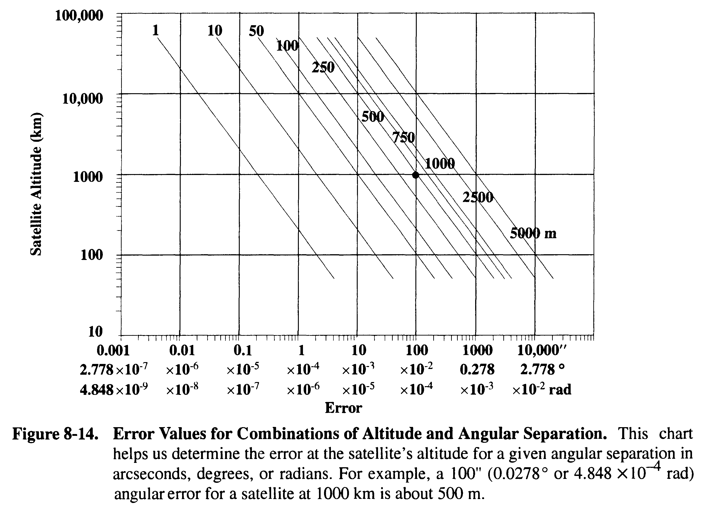

Vallado, D. A., Fundamentals of Astrodynamics and Applications, New York, NY: The McGraw-Hill Companies, Inc., 1997.

Angle-only observations
=======================

Right ascension $\alpha$ and declination $\delta$ 总是在 topocentric 系下观测得到，没有办法直接得到 geocentric 下的结果。
- 通常是拍照卫星，然后与背景的恒星比较，来确定角度。
- 恒星距离很远，topocentric 和 geocentric 差别很小，但对于卫星区别很大

估计的基本方法有以下几种 (p387--)：
- Laplacian: 只拟合中间观测点，对近地卫星效果差
- Gaussian: 拟合所有观测点，对观测点分布有要求，通常小于60度
- double r-iteration: 观测点大范围分布（比如多观测站），对各种轨道都可用

<!-- more -->

TLE
===

p140: 
$B^\* = \frac{1}{2} \frac{C\_D A}{m} \rho\_0$. 
Ballistic Coefficient $BC = \frac{R\_{\rm Earth}\rho\_0}{2B^\*}$. 

定轨 Orbit Determination
=======================

Sensor site 的一些基本信息：
- p415: In fact, a typical sensor site's observation of a pass by a satellite usually results in hundreds of observations which are very close together.

观测/测量精度/Accuracy/Uncertainty
- p731: In general, along-track errors are greatest because we can't get precise timing information. Cross-track errors are usually better, typically resulting from a sensor's misalignment. Radial errors are usually the smallest.
- 根据 Figure 8-14 可以判断 range 和 angular 观测的精度 trade-off

<!-- 需要调整图片大小 -->

其它
---

(p732) Remember, least-squares techniques will estimate the average values, whereas filters can better track the time-varying values.