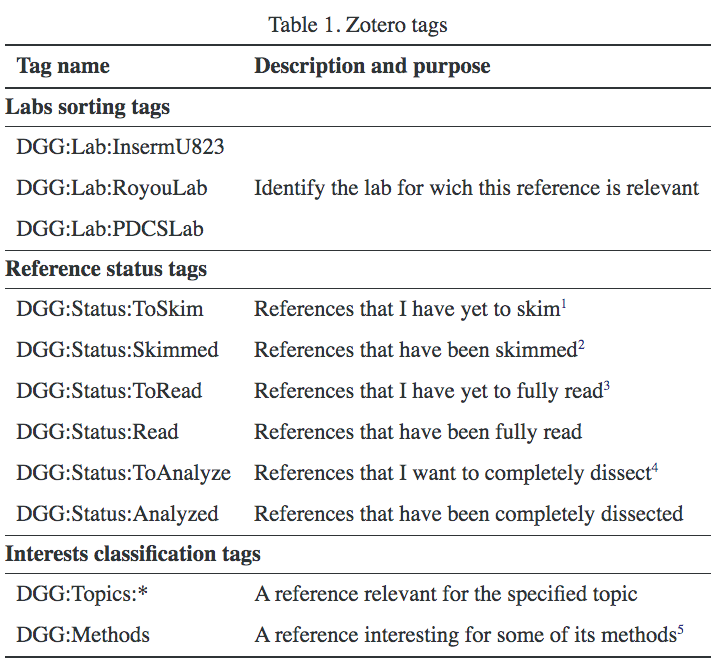

My conclusion:
> Simple DO NOT use `Mendeley`.\
`Zotero` can do everything `Mendeley` could, even more elegantly.

Sadly the development of `Docear` stops.

<!-- more -->

# Working flows

## Reading on tablet 

`ZotFile` + `Dropbox`

Help concentrate on papers.

## Tag system
2020-02-14 15:24:10:\
This is the best practice of using the tag system in Zotero that I ever heard of.

[2019, Damien Goutte-Gattat, "Managing academic literature with Zotero and Docear"](https://incenp.org/notes/2019/managing-academic-literature.html)

1. Ideally this tag should not be used; it’s better to take the time to actually skim the paper rather than marking it as “to be skimmed”.
2. “Skimmed” references should be accompanied with a note summarizing them.
3. All references tagged with DGG:Status:ToRead or higher should have been imported into Docear.
4. Typically the case for papers I want to present in a journal club or a similar context.
5. More precise tags can be added “below”, similar to what is done for the Topics category.

### The tags I am using now:

Name | comments
----:|:--------
`_Status:ToSkim` |
`_Status:Skimmed` |
`_Status:ToRead` |
`_Status:Read` |
`_Status:ToAnalyze` |
`_Status:Analyzed` |
`_Status:ToImplement` | Implement the methods or simulations in the paper.
 |
`-Methods:XXX` | Particular methods used.
 |
`-Rate:9` | Provide a rate from 0 (useless) to 9 (useful)
 |
`XXX` | without a prefix, it should means `>Topics:XXX`

> Different from Damien who doesn't use `Collections` much, I use them to organize papers into specific disciplines.

