> (Short bio) 
> Dr. Hao Peng is a Postdoctoral Associate at Rutgers University, under the supervision of Prof. Xiaoli Bai. He obtained his PhD in aerospace engineering in 2016 from Beihang University. 
> He is recently working on developing on-board machine learning calibration methods for space sensors. 
> He is also working on a machine learning approach to improve orbit prediction accuracy. 
> His research interests also include: restricted three-body problem; dynamical systems; deep space trajectory design;optimal control; low-thrust trajectory design; etc.

# 0. Bio

:mortar_board: Dr. **Hao Peng** is now a Postdoctoral Associate in the [Mechanical and Aerospace Engineering Department](https://mae.rutgers.edu/) at Rutgers University, NJ, USA.

I am working with [Prof. Xiaoli Bai](http://x-bai.rutgers.edu/) on several projects recently.\
We have been actively promoting the intersection of aerospace dynamics and machine learning techniques.
Up to now, we have published a series of papers and presented several conference reports about using machine learning models to improve orbit prediction accuracy, which are validated using both simulated data and publicly available space object catalog data. 
We are still exploring the limits of this novel approach. 
Please see [6.1. Machine Learning in Aerospace](#6-1-machine-learning-in-aerospace) below for details.

Before joining Prof. Bai's research group at Rutgers, I received my PhD degree in Aerospace Engineering from Beihang University (previously known as Beijing University of Aeronautics and Astronautics). 
My PhD advisor was Prof. Shijie Xu who is a renowned professor in the aerospace area.
[My PhD thesis (in Chinese)](no_link_yet) has been selected as *Excellent Doctoral Degree Dissertation* of the year 2016, among 10 theses from around 20 departments. 
Most of the content in the thesis have been published in English in top-ranking journals, please check [6.2. Restricted Three-Body Problem](#6-2-restricted-three-body-problem) below for details.

# 1. Educational Background


title Dr. Hao Peng's Study Experience
dateFormat  YYYY-MM-DD
axisFormat  %Y/%m

section Beijing, China
Undergraduate Study at Beihang University : crit, active,    des1, 2007-09-01, 2011-07-01
Ph.D. study at Beihang University : crit, active,    des2, after des1, 2016-06-12
Dynamical System Summer School at Beihang University: crit, active, 2009-08-01, 2009-08-20

section Barcelona, Spain
Visiting Student at UPC : crit, active, 2015-09-15, 2015-12-15

section Haifa, Israel
Satellite Formation Flying Summer School at Technion : crit, active, 2012-07-20, 2012-08-20


**2011/09 -- 2016/06**: <mark>Ph.D of Engineering</mark>
- [Honors College of Beihang University](http://hc.buaa.edu.cn/) and School of Astronautics, Beihang University
- Dissertation: **Orbital Dynamics in the Elliptic Restricted Three-Body Problem for Deep Space Exploration** (in Chinese; most chapters have been published on top journals in English)
- Supervisor: Prof. Shijie Xu

**2007/09 -- 2011/07**: <mark>Bachelor of Engineering</mark>
- [Honors College of Beihang University](http://hc.buaa.edu.cn/) and School of Astronautics, Beihang University
- Dissertation: Venus Exploring Trajectory Optimal Design using Variable-Specific-Impulse Magnetoplasma Rocket (in Chinese)
- Supervisor: Prof. Shijie Xu

**2015.09 -- 2015.12**: Visiting Ph.D. student
- Departament de Matemàtica Aplicada I, Universitat Politècnica de Catalunya (UPC), Barcelona, Spain
- Work: Lunar polar orbit to Sun-Earth L2 point libration orbit transfer trajectory design and survey
- Supervisor: Prof. Josep J. Masdemont

**2013.08 -- 2013.08**: Visiting Ph.D. student
- Aerospace Engineering, Israel Institute of Technology (Technion), Haifa, Israel
- Program: Satellite Formation Flying Summer School
- Supervisor: Prof. Pini Gurfil 

I am a man of vision. 
I have determined to conduct scientific research in aerospace engineering (AE) since high school.
During my undergraduate and graduate studies, I have taken a lot of courses to solid my research background as much as I could.
While mastering various knowledge and skills, I also attach great importance to developing my own vision, critical thinking and broad vision.


<!-- tab Mathematics -->
Higher level:
- Dynamical system theory,
- Linear algebra, 
- Matrix theory, 
- Mathematical modeling,
- Optimal control, 
- Optimization theory and algorithm, 
- Stochastic process, 

Undergraduate level:
- Abstract algebra, 
- Differential geometry, 
- Functional analysis, 
- Partial differential equation, 
- Wavelet analysis, 
- Topology, 
<!-- endtab -->

<!-- tab Computer Sciences -->
- Discrete mathematics
- Parallel computing
- Network Population Analysis
<!-- endtab -->

<!-- tab Physics -->
- Celestial dynamics, 
- Quantum mechanics, 
- Mathematical physics
<!-- endtab -->

<!-- tab Aerospace Engineering -->
- Attitude and Orbit Dynamics, 
- Modern Control Theory, 
- Robust Control Theory and Applications, 
- Space Mission Analysis and System Design, 
<!-- endtab -->

<!-- tab Self-learned Books -->
Only list some books that I have seriously spent a lot of time studying carefully.
1. VI Arnol’d, Mathematical methods of classical mechanics, 1989. [[Link]](http://books.google.com/books?hl=en&lr=&id=Pd8-s6rOt_cC&oi=fnd&pg=IA2&dq=Mathematical+Methods+Of+Classical+Mechanics&ots=uKrcvJJKJt&sig=Jkk8u3TKSZfWjzrROe1u3zophv8).
2. Wang Sang Koon, Martin W. Lo, Jerrold E. Marsden, and Shane D. Ross, Dynamical Systems, the Three-Body Problem and Space Mission Design, 2005. [[Link]](http://www2.esm.vt.edu/~sdross/books/index.html#space_book).
3. Stephen Wiggins, Introduction to Applied Nonlinear Dynamical Systems and Chaos, New York: Springer-Verlag, 2003. [[Link]](http://link.springer.com/10.1007/b97481).
4. Kenneth R. Meyer, Glen R. Hall, and Dan Offin, Introduction to Hamiltonian Dynamical Systems and the N-Body Problem, New York, NY: Springer New York, 2009. [[Link]](http://www.springerlink.com/index/10.1007/978-0-387-09724-4).
5. Jeffrey S. Parker, and Rodney L. Anderson, Low-Energy Lunar Trajectory Design, Wiley, 2014. [[Link]](https://descanso.jpl.nasa.gov/monograph/series12/LunarTraj--Overall.pdf).
6. Kyle T. Alfriend, Srinivas R. Vadali, Pini Gurfil, Jonathan P. How, and Louis S. Breger, Spacecraft Formation Flying, 2010.
7. Victor G. Szebehely, Theory of Orbits - The Restricted Problem of Three Bodies, New York and London: Academic Press, 1967.
8. David A. Vallado, Fundamentals of Astrodynamics and Applications, New York, NY: The McGraw-Hill Companies, Inc., 1997. [[Link]](http://www.springer.com/us/book/9780070668348).

(Find more book recommendations at my [book reading notes](../categories/Notes/Book-Notes/).)
<!-- endtab -->


# 2. Research Interests

I have experience on various of topics.



<!-- tab General Aerospace Topics -->
Guidance, Navigation, and Control (GNC)

Space Situational Awareness (SSA)

Observation Scheduling
<!-- endtab -->

<!-- tab Mechanics and Dynamics -->
Orbital Mechanics

Restricted Three-Body Problem (RTBP) Model

Deep Space Exploration
<!-- endtab -->

<!-- tab Trajectory Design & Optimization -->
Trajectory Design and Optimization

Low-Thrust & Low-Energy Transfer

Station-Keeping Strategy/Control
<!-- endtab -->

<!-- tab Computer Science -->
Machine Learning

Data Mining

Reinforcement Learning

Visualization
<!-- endtab -->



<!-- # Personal Shortcomings

Nobody is perfect, so I'm never afraid of letting people know my shortcomings before knowing my strengths.
I also prefer people pointing out my shortcomings directly. 
In my opinion, this is a friendly behavior meaning they are being serious to me.


<!-- tab So, my weaknesses include but not limited to: (click to see...) -->
- Sometimes my perfectionism could cause high pressure to people around me. As I grow up, I realize that I like people pointing out my defects doesn't mean everybody enjoys it. People might think of me very demanding. However, I usually insist to be strict with people in research and work.
- Cannot play musical instrument, neither sing or dance well. Maybe because too shy. Partially due to my bad memory on lyrics and actions. But I enjoy musics and arts.
- "Bad" memory on something. Since my childhood, I rely on logic a lot, so I'm good at memorizing logical things but not other thing. For example, I depends greatly on ~~Mendely~~Zotero to organize my paper collections, because I can remember the techniques and progresses of certain kinds of research, but I usually feel difficult to memorize the authors. As another example, my vocabulary is small, although I am still working hard to improve.
- I forgot what's next...
<!-- endtab -->
 -->

# 3. Research Experience

Curiosity and perfectionism are the driving force behind my career in scientific research.

Since 2011 when I starting my PhD studying (till the updating date of this page), I have published 15 papers and presents at top conferences every year. 
I really appreciate all the supports and instructions I have received from all my advisors and supervisors.

Most of my publications with my supervisor of the time were done through a collaborative working.
The general direction was set up with the supervisor.
Then, I was responsible for all the rest detailed works including implementations and analysis.
I'm really enjoying this working flow because I can both learn the big vision of all my supervisors and practice organizing time and materials to accomplish a research project. 
These experience help me preparing for a future leading role, for example, either a PI (Principle Investigator) or a industrial manager.

# 4. Teaching Experience

I am enthusiastic for teaching.
I deeply believe that knowledge belongs to all the human beings and everyone should have access to the best education.

I have given several introduction lectures (80 mins) to some graduate students in MAE, Rutgers.


<!-- tab 2019 -->
2019/02/10: Introduction to Applications of Control Theory in Aerospace

2019/04/16: Introduction to Gaussian Processes Regression
<!-- endtab -->

<!-- tab 2018 -->
2018/10/02: Interplanetary Trajectory Design

2018/11/27: Restricted Three-Body Problem Model for Trajectory Design

2018/11/29: Introduction to Numerical Methods in CRTBP
<!-- endtab -->


# 5. :computer: Programming Skills



<!-- tab MATLAB -->
Most of my works are accomplished using MATLAB.

Excellent skills.\
Can write neat code.\
Familiar with most toolboxes.\
Experienced at visualizing.
<!-- endtab -->

<!-- tab Java -->
`Orekit` is written in Java.\
All simulations of orbital dynamics related to my machine learning publications (see [Sec. Machine Learning in Aerospace](#Machine-Learning-in-Aerospace)) are carried out using `Orekit`, so I have been pretty experienced to using basic Java.\
But I'm not capable of software development in Java yet.\
Anyway, Java is a good language, easy to learn, having good rules to follow, and giving neat results.
<!-- endtab -->

<!-- tab Python -->
Medium.\
Able to write simulations, modify third-party packages, visualize...
Not able to develop large projects yet.
<!-- endtab -->

<!-- tab R -->
Have experience to use `Rattle` in `R` to data mining.\
We have published one paper using `R`.\
`R` is a good and powerful language, especially for statistic studies, though it seems not quite popular in the astrodynamics/aerospace area.

Once "hacked" an `R` toolkit to transfer database from `Mendeley` to `Zotero`, which is not possible any more because `Mendely` encrypts their database to lock users in.
<!-- endtab -->

<!-- tab C/C++ -->
`C` is the first language I learned. `C/C++` may be the ultimate language, but is a little bit hard to master.\
I could read, use, and write simple codes, but never have a chance to write a big-scale simulations completely in `C/C++`.\
Not much experience in pure C/C++ developing. Always have interests in hacking into `GMAT`.
<!-- endtab -->

<!-- tab FORTRAN -->
I learned FORT77 in Barcelona by myself in just two weeks.\
Modern fortran is no harder than FORT77, so I have confidence to start a new work in Fortran, if necessary.
<!-- endtab -->

<!-- tab Arduino -->
In my spare time, I learned some Arduino tutorials.\
Similar but much easier than `C/C++`.\
A little bit complicated than MATLAB.
<!-- endtab -->

<!-- tab Website Languages -->
Learned through building my own website, to name a few:
`CSS`, `html`, `xml`, `json`, `JavaScript`...\
I'm not an expert in any of these, but I can learn to make use of them if necessary.
<!-- endtab -->

<!-- tab Others -->
Programming is just talking to machine.\
Machine does not make error, but human does, because human makes machine.
<!-- endtab -->


I use Git regularly to manage all my codes. 
[My GitHub is here](https://github.com/astroHaoPeng), but most work-related codes are in private repositories (available upon requests).\
BTW, my collection of useful third-party repositories is also worth a look.

# 6. :page_facing_up: Academic Contributions

Here is a list of my journal publications and conference presentations. 
Brief introductions are attached below each paper to help understanding our studies.
You are always welcomed to discuss or leave comments at the bottom of the page.\
(Papers are listed in a recommended reading order.)\
([The chronological list is available here.](./publication-list))


`(J)` -- **peer-reviewed journal paper**.\
`(C)` -- **conference paper**.

<!-- citation format: Elsevier - Harvard (with titles) -->

## 6.1. Machine Learning in Aerospace

These machine learning results are collaborative works with [Prof. Xiaoli Bai](http://x-bai.rutgers.edu/) in [Rutgers University, Mechanical and Aerospace Engineering](https://mae.rutgers.edu/). 

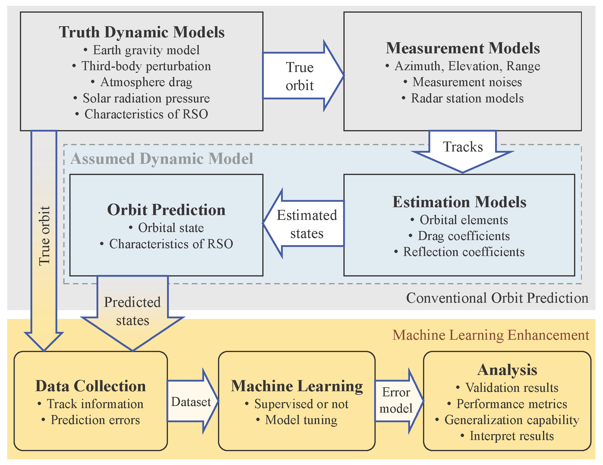



<!-- tab Improve Orbit Prediction Accuracy -->

`(J)` Hao Peng, and Xiaoli Bai, “<mark>Improving orbit prediction accuracy through supervised machine learning</mark>,” Advances in Space Research, vol. 61, May 2018, pp. 2628–2646. [[Link]](http://www.sciencedirect.com/science/article/pii/S0273117718302035).\
==========\
We present a methodology to predict RSOs' trajectories with higher accuracy. 
Inspired by the machine learning (ML) theory through which the models are learned based on large amounts of observed data and the prediction is conducted without explicitly modeling space objects and space environment, the proposed ML approach integrates physics-based orbit prediction algorithms with a learning-based process that focuses on reducing the prediction errors.

Using a simulation-based space catalog environment as the test bed, the paper demonstrates three types of generalization capability for the proposed ML approach: 
1. the ML model can be used to improve the same RSO’s orbit information that is not available during the learning process but shares the same time interval as the training data;
2. the ML model can be used to improve predictions of
the same RSO at future epochs; 
3. the ML model based on a RSO can be applied to other RSOs that share some common features.

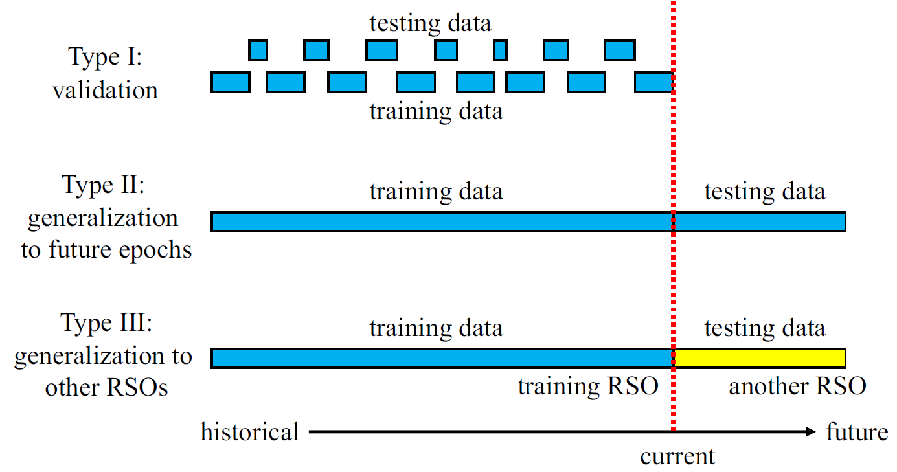

**Support Vector Machine (SVM)** algorithm is used as the ML model because it has universial approximation capability and sparse feature.



`(J)` Hao Peng, and Xiaoli Bai, “<mark>Exploring Capability of Support Vector Machine for Improving Satellite Orbit Prediction Accuracy</mark>,” Journal of Aerospace Information Systems, vol. 15, Jun. 2018, pp. 366–381. [[Link]](https://arc.aiaa.org/doi/10.2514/1.I010616).\
`(C)` Hao Peng, and Xiaoli Bai, “Limits of Machine Learning Approach on Improving Orbit Prediction Accuracy,” Advanced Maui Optical and Space Surveillance (AMOS) Technologies Conference, Wailea Marriott: 2017. [[Link]](https://amostech.com/TechnicalPapers/2017/Astrodynamics/Bai.pdf).\
==========\
The limits and limitation of the above ML approach using SVM models have been explored. 
It is demonstrated that
1. the support vector machine model can reduce the orbit prediction errors with both good average and individual performances.
2. the performance can be further improved with more training data, until adequate data information has been exploited. Last, it is illustrated that 
3. the support vector machine model shall be updated frequently, and orbit predictions should not be made too far in the future. 
It is concluded that the capabilities of the machine learning approach for improving orbit prediction accuracy are very promising.

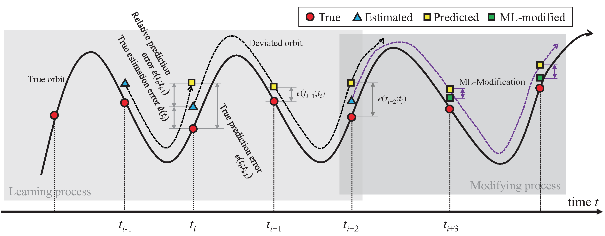

(In the journal version, further improvements have been made based on the reviewers' comments and the feedbacks on the conference.)



`(J)` Hao Peng, and Xiaoli Bai, “<mark>Artificial Neural Network–Based Machine Learning Approach to Improve Orbit Prediction Accuracy</mark>,” Journal of Spacecraft and Rockets, vol. 55, Sep. 2018, pp. 1248–1260. [[Link]](https://arc.aiaa.org/doi/10.2514/1.A34171).\
`(C)` Hao Peng, and Xiaoli Bai, “Using Artificial Neural Network in Machine Learning Approach to Improve Orbit Prediction Accuracy,” 2018 Space Flight Mechanics Meeting, AIAA SciTech Forum, American Institute of Aeronautics and Astronautics, 2018. [[Link]](https://arc.aiaa.org/doi/10.2514/6.2018-1966).\
==========\
The **Artifial Neural Network (ANN)** algorithm is exploited in the proposed ML approach. 
For ANN, the biggest difficulty is to design the network structure, so that it will not either under-fit nor over-fit the dataset. 
We carried out a grid search of critical parameters and presented the analysis of the resulting tendencies.

In this paper, for the first time, we demonstrated a **coverage analysis** of the learning variables, which could obviously improve the type-III generalization capability in the previous studies. 
Specifically, we focused on two cased:
1. vary the orbit RAAN by $\Delta\Omega = -45\sim45\deg$ every 5 deg.
2. vary the semi-major axis by $\Delta a = -45\sim45\deg$ every 10 km.

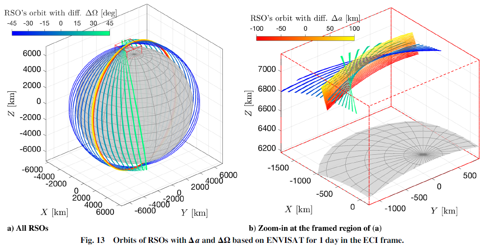

(In the journal version, further improvements have been made based on the reviewers' comments and the feedbacks on the conference.)



`(J)` Hao Peng, and Xiaoli Bai, “<mark>Gaussian Processes for improving orbit prediction accuracy</mark>,” Acta Astronautica, vol. 161, Aug. 2019, pp. 44–56. [[Link]](https://linkinghub.elsevier.com/retrieve/pii/S0094576518320344).\
`(C)` Hao Peng, and Xiaoli Bai, “Obtain Confidence Interval for the Machine Learning Approach to Improve Orbit Prediction Accuracy,” 2018 AAS/AIAA Astrodynamics Specialist Conference, Snowbird, UT: 2018, pp. 1–17.\
==========\
SVN and ANN are powerful algorithms. However, they belong to classical frequentist method that only generate point estimation but not the distribution information. 
In this paper, we have extended the ML approach to a Bayesian modeling method, **Gaussian Processes (GPs)**, which naturally gives uncertainty information about the ML-predicted orbit prediction accuracy.

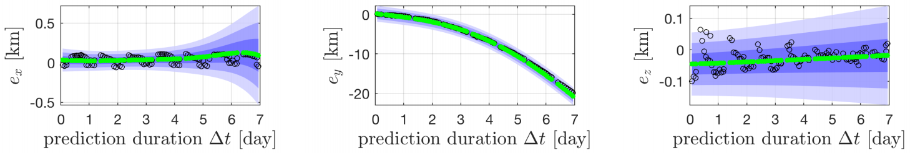
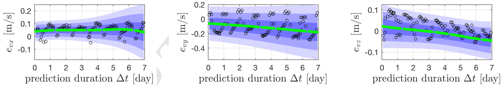

(In the journal version, further improvements have been made based on the reviewers' comments and the feedbacks on the conference.)



`(J)` Hao Peng, and Xiaoli Bai, “<mark>Comparative Evaluation of Three Machine Learning Algorithms on Improving Orbit Prediction Accuracy (accepted)</mark>,” Astrodynamics, vol. 0, 2019, p. 0.\
`(C)` Hao Peng, and Xiaoli Bai, “Comparison of Effective Machine Learning Algorithms on Improving Orbit Prediction Accuracy,” 69th International Astronautical Congress (IAC), Bremen, Germany: 2018, pp. 1–12.\
==========\
In this paper, we provide a systematical comparison study of the three ML algorithms: support vector machine (SVM), artificial neural network (ANN), and Gaussian processes (GP). 
In a simulation environment consisting of orbit propagation, measurement, estimation, and prediction processes, totally 12 resident space objects (RSOs) in SSO, LEO and MEO are simulated to compare the performance of three ML algorithms.

The results in this paper show that 
1. ANN usually has the best approximation capability but is easiest to overfit data; 
2. SVM is least likely to overfit but the performance usually cannot surpass ANN and GP. 
3. the ML approach with all the three algorithms is observed to be robust with respect to the measurement noise.

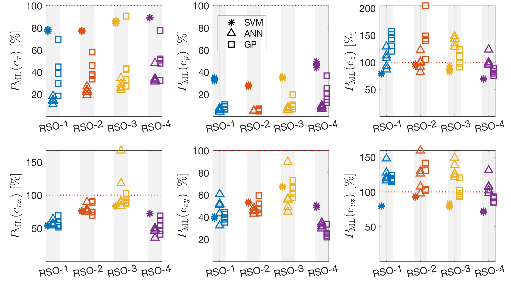

(The journal version has been accepted for a long time but still not online yet.)

(In the journal version, further improvements have been made based on the reviewers' comments and the feedbacks on the conference.)


<!-- endtab -->

<!-- tab Using Real Data of TLE & ILRS (click to expand) -->

TLE -- Two-Line Element (data format), available at [Space-Track.org](https://www.space-track.org/) and [CelesTrak.com](https://celestrak.com/).\
ILRS -- International Laser Ranging Service, available at [ILRS website](https://ilrs.cddis.eosdis.nasa.gov/about/index.html).



`(J)` Hao Peng, and Xiaoli Bai, “<mark>Machine Learning Approach to Improve Satellite Orbit Prediction Accuracy Using Publicly Available Data</mark>,” The Journal of the Astronautical Sciences, May 2019. [[Link]](http://link.springer.com/10.1007/s40295-019-00158-3).\
`(C)` Hao Peng, and Xiaoli Bai, “A Machine Learning Approach to Improve Satellite Orbit Prediction Accuracy: Validation Using Publicly Available Data,” John L. Junkins Dynamical Systems Symposium, College Station, TX: 2018.\
==========\
The ML approach (SVM algorithm) is validated using a combination of the TLE catalog and the ILRS catalog, which are all publicaly available data sources. 
Due to the limited information in the TLE catalog, **the learning variables have been redesigned**.
Finally, the results show that the performace can be reserved in most cases:
1. the orbit prediction accuracy can be improved.
2. the uncertainty information is accurate.

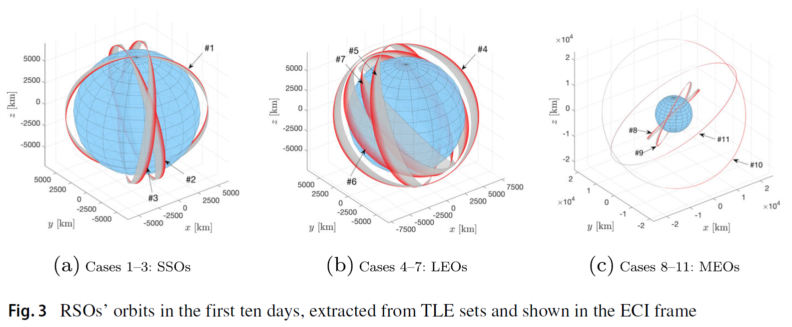

In the journal version, further improvements have been made based on the reviewers' comments and the feedbacks on the conference.



`(J)` Hao Peng, and Xiaoli Bai, “<mark>Gaussian Processes for improving orbit prediction accuracy</mark>,” Acta Astronautica, vol. 161, Aug. 2019, pp. 44–56. [[Link]](https://linkinghub.elsevier.com/retrieve/pii/S0094576518320344).\
`(C)` Hao Peng, and Xiaoli Bai, “Obtain Confidence Interval for the Machine Learning Approach to Improve Orbit Prediction Accuracy,” 2018 AAS/AIAA Astrodynamics Specialist Conference, Snowbird, UT: 2018, pp. 1–17.\
==========\
SVN and ANN are powerful algorithms. However, they belong to classical frequentist method that only generate point estimation but not the distribution information. 
In this paper, we have extended the ML approach to a Bayesian modeling method, **Gaussian Processes (GPs)**, which naturally gives uncertainty information about the ML-predicted orbit prediction accuracy.

(In the journal version, further improvements have been made based on the reviewers' comments and the feedbacks on the conference.)



`(C)` Hao Peng, and Xiaoli Bai, “Generalization Capability of Machine Learning Approach Among Different Satellites: Validated Using TLE Data,” 2018 AAS/AIAA Astrodynamics Specialist Conference, Snowbird, UT: 2018, pp. 1--17.\
==========\
The type-III generaliztion capability, from one RSO to another, is validated using TLE and ILRS data.
Due to the limited information in both catalog, it is hardly to draw any concrete conclusion, which is left for future studies.
However, we still observed that the ML approach is effective in many cases.

This direction is still under research. We may have more concerete results after IAC-2019 in Washington DC.

<!-- endtab -->

<!-- tab Extend to HAMR Objects (click to expand) -->

HAMR -- High Area-to-Mass-Ratio, complicated attitude-orbit-coupled dynamics, usually more sensitive to attitude dependent forces like atmosphere drag or solar radiation pressure.



`(J)` Hao Peng, and Xiaoli Bai, “<mark>Recovering Area-to-Mass Ratio of Resident Space Objects through Data Mining</mark>,” Acta Astronautica, vol. 142, Jan. 2018, pp. 75–86. [[Link]](http://www.sciencedirect.com/science/article/pii/S0094576517304058).\
==========\
Using random forest (RF) as the either a classification or a regression tool, we show that it is possible to recover the information of an unknown RSO. 
This capability is critical for SSA. 

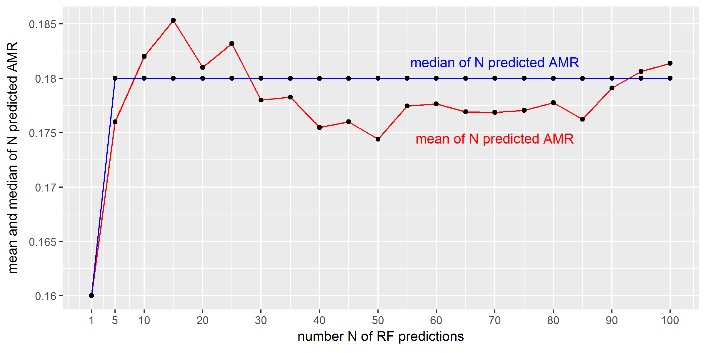
<!-- endtab -->



## 6.2. Restricted Three-Body Problem


**CRTBP** -- Circular Restricted Three-Body Problem\
**ERTBP** -- Elliptic Restricted Three-Body Problem\
**ME-Halo Orbit** -- Multi-revolution Elliptic Halo Orbit, a special kind of libration point periodic orbit that only exists in the ERTBP model, first published by me and my PhD supervisor, Prof. Shijie Xu.




<!-- tab ME-Halo Orbit -->

`(J)` Hao Peng, and Shijie Xu, “<mark>Stability of two groups of multi-revolution elliptic halo orbits in the elliptic restricted three-body problem</mark>,” Celestial Mechanics & Dynamical Astronomy, vol. 123, Nov. 2015, pp. 279–303. [[Link]](http://link.springer.com/10.1007/s10569-015-9635-2).\
`(C)` Peng, H., Xu, S., 2014b. Numerical stability study of multi-circle elliptic halo orbit in the elliptic restricted three-body problem, in: AAS/AIAA Spaceflight Mechanics Conference 2015. Presented at the AAS/AIAA Spaceflight Mechanics Conference 2015, Laurel, pp. 1–20. [has a journal-version] \
==========\
We find that the ME-Halo orbit shows very different evolution of stability characteristics than conventional Halo orbits.
Generally speaking, they are very unstable, including several bifurcations of their characteristic curves in the phase space.

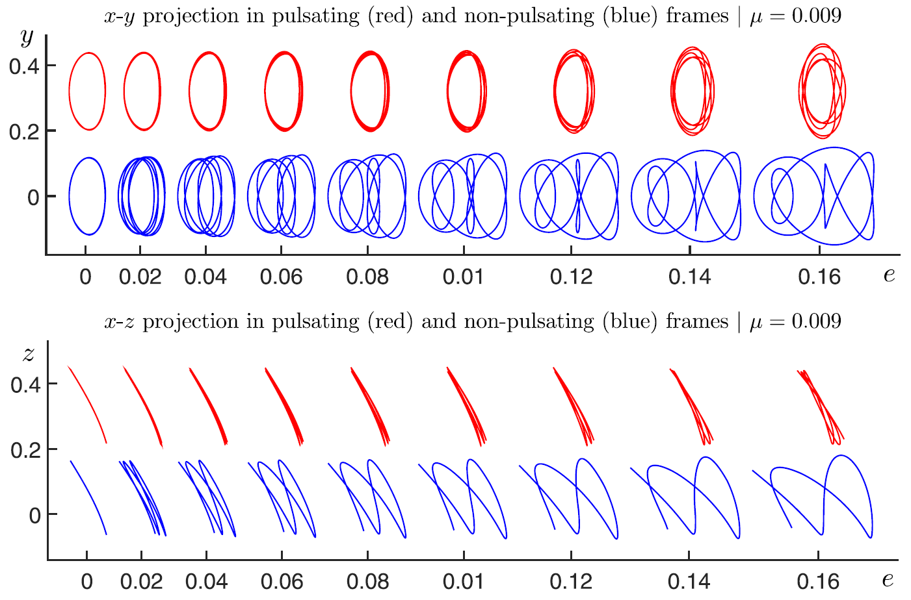

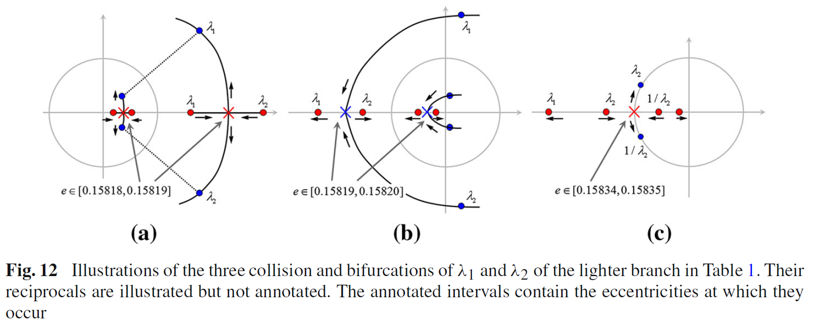



`(J)` Hao Peng, Xiaoli Bai, and Shijie Xu, “<mark>Continuation of periodic orbits in the Sun-Mercury elliptic restricted three-body problem</mark>,” Communications in Nonlinear Science and Numerical Simulation, vol. 47, Jun. 2017, pp. 1–15. [[Link]](http://linkinghub.elsevier.com/retrieve/pii/S100757041630404X).\
==========\
A tangent continuation strategy along with the multi-segment optimization method is developed to constructing ME-Halo orbit in the highly elliptic Sun-Mercury system.

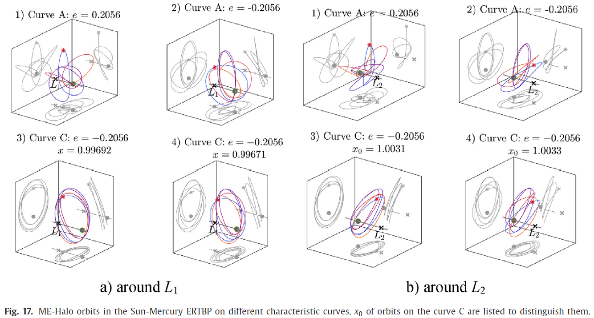

<!-- endtab -->

<!-- tab Transfer Trajectory to ME-Halo (click to expand) -->

`(J)` Hao Peng, Xiaoli Bai, Josep J. Masdemont, Gerard Gómez, and Shijie Xu, “<mark>Libration Transfer Design Using Patched Elliptic Three-Body Models and Graphics Processing Units</mark>,” Journal of Guidance, Control, and Dynamics, vol. 40, Dec. 2017, pp. 3155–3166. [[Link]](https://arc.aiaa.org/doi/10.2514/1.G002692).\
==========\
We proposed a Patched ERTBP model for the Sun-Earth-Moon system.
Then we searched for the low-energy transfer trajectory in this Patched ERTBP model.
The comparison with the results in the ephemeris model shows that the new model captures the dynamics very well and is more accurate than a Patched CRTBP model.
More importantly, this new model allows easy implementation in a GPU parallel fashion. 

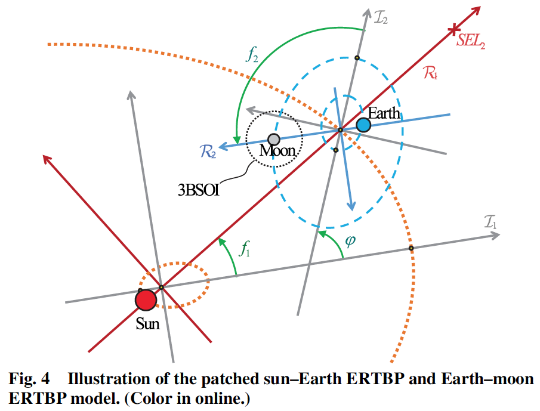

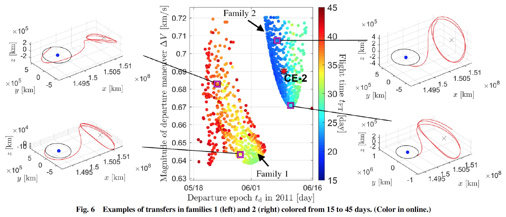

The usage of ERTBP enables using GPU parallel computing to design transfer trajectories efficiently.
The GPU parallel computing is implemented through MATLAB which is easier to master for engineers with limited computer science expertise.




`(J)` Hao Peng, and Shijie Xu, “<mark>Transfer to a Multi-Revolution Elliptic Halo Orbit in Earth-Moon Elliptic Restricted Three-Body Problem Using Stable Manifold</mark>,” Advances in Space Research, vol. 55, Nov. 2015, pp. 1015–1027. [[Link]](http://linkinghub.elsevier.com/retrieve/pii/S0273117714007169).\
`(C)` Peng, H., Xu, S., 2014a. Transfer to Multi-circle Elliptic Halo Orbit in Earth-Moon Elliptic Restricted Three-Body Problem, in: 24th International Symposium on Space Flight Dynamics - 24th ISSFD. Presented at the 24th International Symposium on Space Flight Dynamics - 24th ISSFD, Laurel, pp. 1–15. [has a journal-version] \
==========\
Unlike the common Halo orbit in the CRTBP, the ME-Halo can have two stable directions, thus a two-dimensional (un)stable manifold which can be used to design impulsive tranfer. 
In this paper, we investigated the two-impulsive transfer from Earth to a special lunar ME-Halo orbit.

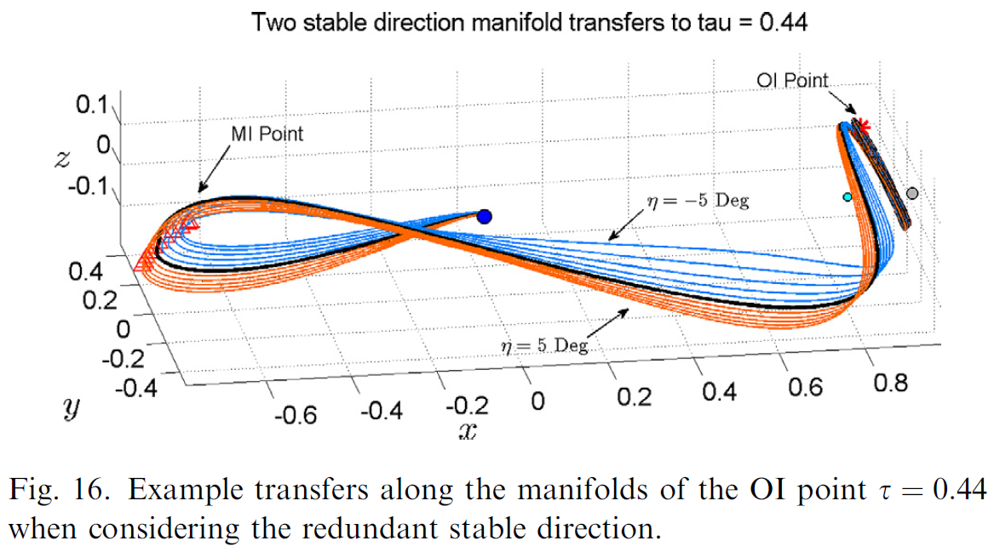



`(J)` Hao Peng, and ShiJie Xu, “<mark>Low-energy transfers to a Lunar multi-revolution elliptic halo orbit</mark>,” Astrophysics and Space Science, vol. 357, May 2015, p. 87. [[Link]](http://link.springer.com/10.1007/s10509-015-2236-4)\
`(C)` Peng, H., Xu, S., Shu, L., 2015b. Low-energy transfers to an earth-moon multi-revolution elliptic halo orbit, in: AAS/AIAA Spaceflight Mechanics Conference 2015. Presented at the AAS/AIAA Spaceflight Mechanics Conference 2015, Williamsburg, VA, pp. 1–19. [has a journal-version]\
==========\
Simialr to the low-energy (or weak stability boundary) transfer concept in the CRTBP model, there also exist low-energy transfer trajectories to the lunar ME-Halo orbit in the ERTBP.
Due to the additional freedom of the whole system, the eccentricity, the distribution of the transfers in the phase space is even sparser and more compoicated.

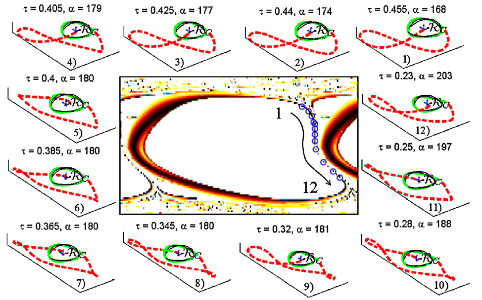

<!-- endtab -->

<!-- tab ME-Halo Maintenance & Applications (click to expand) -->

`(J)` Hao Peng, and Xiaoli Bai, “<mark>Natural Deep Space Satellite Constellation in the Earth-Moon Elliptic System</mark>,” Acta Astronautica, vol. 153, Dec. 2018, pp. 240–258. [[Link]](https://linkinghub.elsevier.com/retrieve/pii/S0094576517313322).\
`(C)` Hao Peng, and Xiaoli Bai, “New Natural Formation Flying Configurations in the Earth-Moon Elliptic Three-Body System,” 9th International Workshop on Satellite Constellations and Formation Flying, University of Colorado Boulder: 2017.\
==========\
The previously developed ME-Halo orbit can be used to design new space constellations in the Earth-Moon system. 
The prototype developed under the ERTBP model is expected to be more realistic and reliable, since it has taken the eccentricity of the Earth-Moon system into consideration.

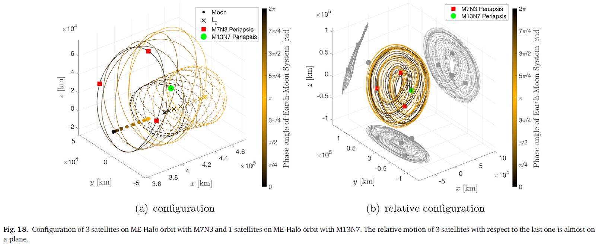



`(J)` Hao Peng, Yuxin Liao, Xiaoli Bai, and Shijie Xu, “<mark>Maintenance of Libration Point Orbit in Elliptic Sun-Mercury Model</mark>,” IEEE Transactions on Aerospace and Electronic Systems, vol. PP, 2017, pp. 1–15. [[Link]](http://ieeexplore.ieee.org/document/8010413/).\
`(C)` Hao Peng, Yuxin Liao, and Shiyuan Jia, “Maintain a libration point orbit in the Sun-Mercury elliptic restricted system,” 26th AAS/AIAA Space Flight Mechanics Meeting, Napa, CA: 2016, pp. 1–18.\
==========\
With the capability of constructing any ME-Halo orbit in the Sun-Mercury system, we further studied the controllability of an ME-Halo orbit, under both the ERTBP model and the more realistic ephemeris model.
We notice that the solar radiation pressure force is not considered in this study, but it should not invalidate the results as it can be accommodated as a centrifugal force in the current framework. 

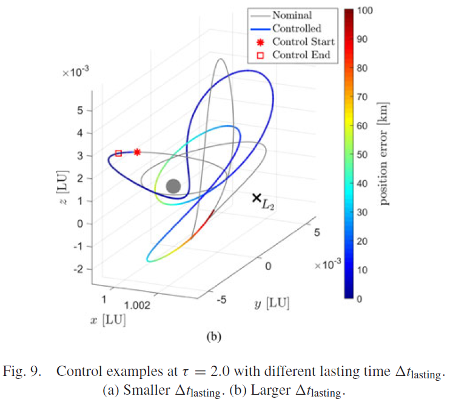

<!-- endtab -->

<!-- tab Non-conservative Energy in ERTBP (click to expand) -->

`(C)` Peng, H., Qi, Y., Xu, S., Li, Y., 2015a. Numerical energy analysis of the escape motion in the elliptic restricted three-body problem, in: AAS/AIAA Spaceflight Mechanics Conference 2015. Presented at the AAS/AIAA Spaceflight Mechanics Conference 2015, Williamsburg, VA, pp. 1–19.\
==========\
The Earth-Moon ERTBP model is demonstrated to non-conservative in the inertial energy.
This opens the opportunity to utilize such escaping feature of the trajectory to design a low-energy escaping trajectory, or vice verse, a low-energy capturing trajectory.

<!-- endtab -->



## 6.3. Symmetric Four-Body Problem


`(J)` Hao Peng, Duokui Yan, Shijie Xu, and Tiancheng Ouyang, “<mark>Linear stability of double–double orbits in the parallelogram four-body problem</mark>,” Journal of Mathematical Analysis and Applications, vol. 433, Jan. 2016, pp. 785–802. [[Link]](http://linkinghub.elsevier.com/retrieve/pii/S0022247X15007416).

By using a variational method to discover periodic orbits with special symmetries, we are able to determine several groups of new periodic orbits in a specialized four-body problem. 
More related studies are referred to [Prof. Duokui Yan's Google Scholar profile](https://scholar.google.com/citations?user=yxL7sJAAAAAJ&hl=en).


## 6.4. Asteroid Exploration

TBD.

## Codes of Above Publications
Some of my codes are shared publicly on [GitHub](https://github.com/AstroH-Peng), such as some [MATLAB multiple-shooting demos](https://github.com/AstroH-Peng/multipleShooting).

Most of my works are maintained in private repositories, but you are welcomed to ask for the codes. 

# 7. Honors

## 7.1. Awards
2017 -- Beihang University Excellent Doctoral Thesis Award\
2015 -- (China) National Scholarship Award for Graduate Students\
2014 -- Ranked 22nd in 7th Global Trajectory Optimization Competition (GTOC) in 2014\
2012 -- Beihang University "Outstanding Graduate Student"\
2010 -- Meritorious Winner in MCM/ICM\
2009 -- First Prize in China Undergraduate Mathematical Contest in Modeling\
2009 -- Third Prize in Chinese Zhou Pei-Yuan Mechanics Contest

## 7.2. Other Scholarships
Win multiple university, college, and industrial study scholarships;\
Win Beihang university outstanding undergraduate student scholarships;\
Excellent undergraduate’s dissertation scholarship

## 7.3. Nominations
2019 -- Regional postdoctoral competition of the Blavatnik Award for Young Scientists (see [News January, 2019](http://x-bai.rutgers.edu/news.html))

# 8. More About Me

Find me at:

[ResearchGate: https://www.researchgate.net/profile/Hao_Peng9](https://www.researchgate.net/profile/Hao_Peng9)

[Google Scholar: https://scholar.google.com/citations?user=kOEKfc0AAAAJ&hl=zh-CN](https://scholar.google.com/citations?user=kOEKfc0AAAAJ&hl=zh-CN)

[LinkedIn: https://www.linkedin.com/in/hao-peng-5499727b/](https://www.linkedin.com/in/hao-peng-5499727b/)

## 8.1 Hobbies
Swimming, Soccer, Badminton, Ping-Pong, ...\
Photography, ...\
Smartphones, Laptops, ...\
Feeding animals in a zoo :smile:

