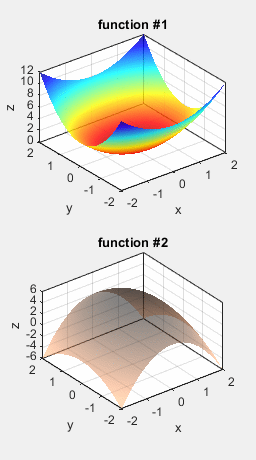
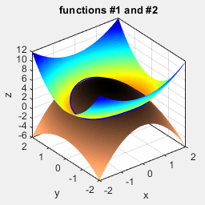
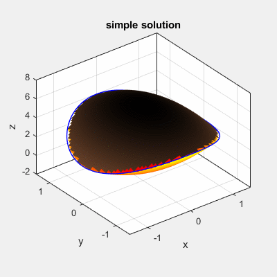
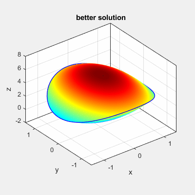
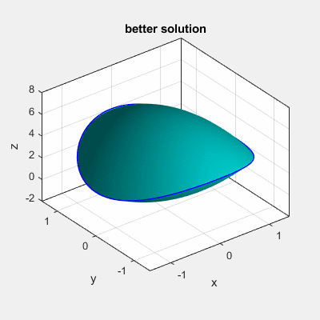
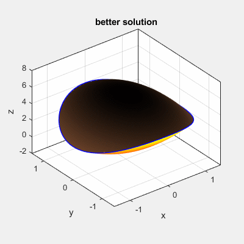
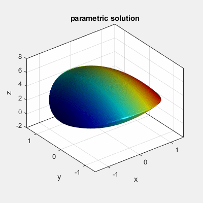

# A post of wechat subscription account: SPACEofPHD

## `isosurface` solution
In `demo_isosurface.m`.

Problem:

Simple solution by setting `NaN`.

Better solution: colored with different tricks.

## Parametric solotion

In `demo_parametric.m`.

